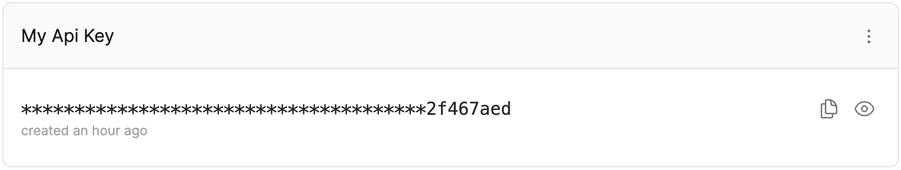

# React API Key Manager

A react component for managing API keys that is compatible with any API Key
management API.



## Getting Started

This component can be used with any React framework. It is compatible with
TailwindCSS, but Tailwind is not required.

### Install

Install the component in your React project

```bash
npm install @zuplo/react-api-key-manager
```

### With Tailwind

Import the component's stylesheet into your `global.css` or equivalent file. The
styles will use your project's tailwind configuration to provide a consistent
theme.

```css
@tailwind base;
@tailwind components;
@tailwind utilities;
@import "@zuplo/react-api-key-manager/tailwind.css";
```

### Without Tailwind

Import the component's stylesheet into your root component (i.e. `App.jsx`),
typically below your other stylesheets.

```jsx
import "./styles/globals.css";
import "@zuplo/react-api-key-manager/index.css";
```

### Custom Styles

The the component's css can be completely customized by copying either the
`tailwind.css` or `index.css` files from
`node_modules/@zuplo/react-api-key-manager/dist/` and modifying the styles to
suite your needs.

## Usage

You can import the `ReactAPIKeyManager` into your React project directly.

```ts
import {
  ApiKeyManager,
  DefaultApiKeyManagerProvider,
} from "@zuplo/react-api-key-manager";

const MyComponent = () => {
  const defaultProvider = new DefaultApiKeyManagerProvider(
    "<BASE_URL>",
    "<ACCESS_TOKEN>"
  );

  return <ApiKeyManager provider={provider} />;
};
```

## Backend API

The API Key Manager component interacts with an API that allows authorized users
to manage their own keys. The easiest way to get started is to use the
[Auth Translation API](https://github.com/zuplo/sample-auth-translation-api)
sample and deploy it to [Zuplo](https://zuplo.com). By default this sample
connects the
[Zuplo API Key Management Service](https://zuplo.com/docs/articles/api-key-management),
but you could adapt the sample to use other services or data storage systems.

## Custom Provider

If you don't want to build an API that conforms to the built-in provider, you
can implement a custom `ApiKeyManagerProvider` in your client to use an existing
or custom API. The Interface for the provider is shown below. Additionally, you
can see the default implementation in
[`packages/react/src/default-provider.ts`](https://github.com/zuplo/api-key-manager/blob/main/packages/react/src/default-provider.ts)

```ts
interface ApiKeyManagerProvider {
  getConsumers: () => Promise<ConsumerData>;
  rollKey: (consumerName: string, expiresOn: Date) => Promise<void>;
  deleteKey: (consumerName: string, keyId: string) => Promise<void>;
  updateConsumerDescription: (
    consumerName: string,
    description: string
  ) => Promise<void>;
  refresh: () => void;
  registerOnRefresh: (callback: () => void) => RegisterHandle;
  unregisterOnRefresh: (handle: RegisterHandle) => void;
}
```

## Community and Contribution

We welcome community contributions and ideas. Please feel free to open an issue
or propose a pull request. [Join us on Discord](https://discord.gg/Y87N4SxjvJ)
if you have questions, feedback, or just want to hang out.

## License

MIT License

Copyright © 2023 Zuplo, Inc. All rights reserved.
